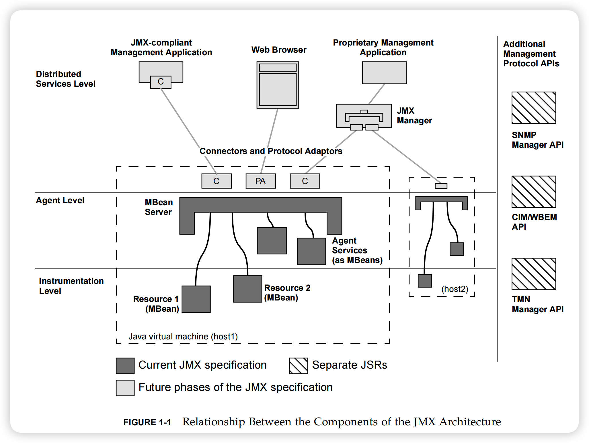

- # JMX （Java Management Extensions）
	- JXM 全称 Java Management Extensions，技术提供构建分布式、Web、模块化的工具，以及管理和监控设备和应用的动态解决方案（Java 需要一套统一的近端和远程监控和管理的架构）。从 Java 5 开始，JMX API 作为 Java SE 的一部分。
	- JMX 规范：
		- JSR 3：JMX 1.0、JMX 1.1 和 1.2 （作为 Java 5 的一部分）
		- JMX 1.4：2006.11.09（作为 Java 6 的一部分）
		- JSR 255：JMX 2.0
		- JSR 160：JMX Remote API 1.0
		- JSR 262：JMX Remote API for Web Services
	- JMX 架构概况：
		- 装配层（Instrumentation Level）：将被管理资源（对象）封装成 JMX 认可的结构，标准 MBean、动态 MBean、开放 MBean 和模型 MBean（[[#red]]==可以理解为 Rest 服务中提供的接口实现、服务实现==）
		- 代理层（Agent Level）：JMX 注册装配层资源的服务器，并且能够暴露成相关通讯协议给分布式服务层（ [[#red]] ==理解为 Rest 服务中 Feign 的封装==）
		  collapsed:: true
			- `mBeanServer.registerMBean(createUserMBean(user), objectName);`
		- 分布式服务层（Distributed Services Level）：通过 JMX 连接和协议适配来实现的应用客户端，比如：Jconsole... （[[#red]]==理解为 Rest 服务中的客户端==）
		- 可添加管理协议 API（Additional management protocol APIs）
		- 
	- 五种结构：描述性接口（元信息接口）-- `MBeanInfo`
		- Attributes：MBean 属性通过 Setter 和 Getter 方法暴露（isReadable/isWritable），类似于 JavaBeans Property
			- JMX API - `MBeanAttributeInfo`，类比 JavaBeans API - `PropertyDescriptor`
		- Operations：定义在 MBean 接口的方法，类同于 JavaBeans Method
			- JMX API - `MBeanOperationInfo`，类比 JavaBeans API - `MethodDescriptor`
		- Notification（非必选实现）：MBean 广播的通知对象和类型，类似于 JavaBeans 事件
			- JMX API - `MBeanNotificationInfo`，类似于 JavaBeans API - `EventSetDescriptor`
		- Constructor：MBean 接口的实现类必须有 `public` 默认构造器
			- JMX API - `MBeanConstructorInfo`
		- ObjectName
			- ObjectName：`domain:key1=value1,key2=value2,...`
			- 比如：`Tomcat:type=ThreadPool,name="http-nio-8848"`
	- 四种 MBean
		- Standrad MBeans -- 静态接口
			- 特征：
				- 标准 MBean 接口属于预定义结构类型，无需实现扩展其他接口，并且 JMX 规范允许实现类存在非接口定义的方法。
				- 在命名规则方面，标准 MBean 接口必须是 Java `interface` 之外，其接口名称必须以 “MBean” 为后缀，例如 `com.example.MyClassMBean`，同时其实现类的名称必须是 "MyClass"，与 Java Beans 内省类似，以上 MBean 接口检查和设计模式的应用的处理称之为内省（introspection）--> 将预定接口进行解析元信息 --> MBeanInfo
			- MXBean
				- 接口的类名必须以 "MXBean" 为后缀
				- 或者使用 `@javax.management.MXBean` antotation
				- MXBean 是一种特殊的 MBean，其属性和方法的类型都是预定义的，可以直接序列化
		- Dynamic MBeans
		  collapsed:: true
			- 需要实现 `javax.management.DynamicMBean`
			- 可扩展性强，但元信息描述构造起来太麻烦
			- `@see javax.management.StandardMBean` 可以将静态 MBean 转换成动态 MBean
		- Open MBeans
		  collapsed:: true
			- 对于自定义的一些类型比如 User，Jconsole 这种客户端是不认识的，Open MBean 提供一些预定义的类型，可以解决这个问题
			- @see `javax.management.openmbean.CompositeData` 合成类型（类 JSON）
			- @see `javax.management.openmbean.TabularData` 扁平化类型（类 Collection）
			- Open MBean 支持的所有类型 @see `javax.management.openmbean.OpenType`
		- Model MBeans
			- 同样是一种 Dynamic MBeans，特点是通用、可配置、快速装配。`DynamicMBean` 和 `OpenMBeanInfo` 接口的实现复杂度是令人沮丧的，而 Model MBeans 则让广大开发人员看到了希望的曙光。
			- Spring 的实现，要么是 Standard MBean/MXBean（实现 XXXMBean/XXXMXBean），如果不是，就按照 Model Bean 来创建。给我一个普通的 POJO，我就可以把你实现成 Model MBean，所以 Spring 就可以支持直接把一个 Bean + @ManageResource 等描述信息 变成Model MBean
		- 注意：从底层而言，所有类型 MBean 最终会变成 DynamicMBean
			- MBeanServer registerMBean --> `com.sun.jmx.mbeanserver.Introspector#makeDynamicMBean`
	- ## Conclusions
		- JDK 1.5 引入 JMX
		- JMX 装配层存在自定义模型 --> JMX 客户端可能不存在这样的模型，因此引入 OpenType 开放 MBean
		- JMX 装配层觉得实现 MBean 或 MXBean 接口很繁杂，需要通过 POJO 注册 MBean，因此引入 Model MBeans
		- JDK 1.6 引入 JConsole 与 JMX 共享 JRE --> 共享 JMX API
		- Spring JMX 集中处理了 MBean、MXBean -> DynamicMBean 和 ModelMBean
	- ## Further Read
		- Tomcat 关于 JMX 监控和管理 - [http://tomcat.apache.org/tomcat-7.0-doc/monitoring.html](http://tomcat.apache.org/tomcat-7.0-doc/monitoring.html)
		- 整合 [https://jolokia.org/](https://jolokia.org/)，实现自定义 JMX MBean，通过 Jolokia 做 Servlet 代理